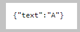

<!DOCTYPE html>
<HTML lang="en">
<META charset="UTF-8">
<BODY>

<H2 id="contents">Study10 README Contents</H2>
<H3 id="top">Research the <a href="https://spring.io/projects/spring-cloud-netflix">Spring Cloud Netflix</a></H3>

 

<I>Consumer ● Producer ● Registration</I>

The microservice registration and discovery are done with the Eureka Service Discovery server. 
The Eureka server uses a <a href="https://resilience4j.readme.io/docs">Resilience4J</a> circuit breaker.

The sections of this project:

<OL>
<li><a href="#ONE"><b>Starting SpringBoot Servers</b></a></li>
<li><a href="#TWO"><b>Web Browser Client</b></a></li>
<li><a href="#THREE"><b>Curl Client</b></a></li>
<li><a href="#FOUR"><b>Scenario with Fallback</b></a></li>
</OL>

Java source code. Packages in modules 'common', 'producer', 'consumer', and 'registration': 
 
 module 'common' application sources:
	<a href="https://github.com/k1729p/Study10/tree/master/microservices-common/src/main/java/kp/common/">kp.common</a> 
 module 'producer' application sources:
		<a href="https://github.com/k1729p/Study10/tree/master/microservices-producer/src/main/java/kp/producer/">kp.producer</a> 
 module 'consumer' application sources:
		<a href="https://github.com/k1729p/Study10/tree/master/microservices-consumer/src/main/java/kp/consumer/">kp.consumer</a> 
 module 'registration' application sources:
		<a href="https://github.com/k1729p/Study10/tree/master/microservices-registration/src/main/java/kp/registration/">kp.registration</a> 

 

    <a href="http://htmlpreview.github.io/?https://github.com/k1729p/Study10/blob/main/docs/apidocs/index.html">
	Java API Documentation</a> 

<h3 id="ONE">❶ Starting SpringBoot Servers</H3>

Action: 
 
 1. With batch file 
'<a href="https://github.com/k1729p/Study10/blob/main/0_batch/01%20MVN%20clean%20install.bat">01 MVN clean install.bat</a>' 
build servers. 
 2. With batch file 
'<a href="https://github.com/k1729p/Study10/blob/main/0_batch/02%20run%20registration%20server.bat">02 run registration server.bat</a>' 
start the Eureka registration server. 
 3. With batch file 
'<a href="https://github.com/k1729p/Study10/blob/main/0_batch/03%20run%20producer%20server.bat">03 run producer server.bat</a>' 
start the <B>producer-service</B> server. 
It registers the 1st instance of <B>producer-service</B>. 
 4. With batch file 
'<a href="https://github.com/k1729p/Study10/blob/main/0_batch/04%20run%20producer%20server%20(9091).bat">04 run producer server (9091).bat</a>' 
start the alternative <B>producer-service</B> server on port 9091. 
It registers the 2nd instance of <B>producer-service</B>. 
 5. With batch file 
'<a href="https://github.com/k1729p/Study10/blob/main/0_batch/05%20run%20consumer%20server.bat">05 run consumer server.bat</a>' 
start the <B>consumer-service</B> server. 

<table style="border:solid">
<caption>Endpoints</caption>
<tbody>
<tr><td style="border:solid"><b>producer-service on port 8081</b></td>
<td style="border:solid"><A HREF="http://localhost:8081/content">http://localhost:8081/content</A></td></tr>
<tr><td style="border:solid"><b>producer-service on port 9091</b></td>
<td style="border:solid"><A HREF="http://localhost:9091/content">http://localhost:9091/content</A></td></tr>
<tr><td style="border:solid"><b>consumer-service</b></td>
<td style="border:solid"><A HREF="http://localhost:8082/content">http://localhost:8082/content</A></td></tr>
<tr><td style="border:solid"><b>Eureka Dashboard</b></td>
<td style="border:solid"><a href="http://localhost:8761/">http://localhost:8761/</a></td></tr>
</tbody>
</table>

<table style="border:solid">
<caption>Eureka Configuration</caption>
<tbody>
<tr><td style="border:solid"><b>producer server</b></td>
<td style="border:solid"><A HREF="https://github.com/k1729p/Study10/blob/main/microservices-producer/src/main/resources/application.yml">
application.yml</A></td></tr>
<tr><td style="border:solid"><b>consumer server</b></td>
<td style="border:solid"><A HREF="https://github.com/k1729p/Study10/blob/main/microservices-consumer/src/main/resources/application.yml">
application.yml</A></td></tr>
<tr><td style="border:solid"><b>registration server</b></td>
<td style="border:solid"><a href="https://github.com/k1729p/Study10/blob/main/microservices-registration/src/main/resources/application.yml">
application.yml</a></td></tr>
</tbody>
</table>

1.1. In the <a href="https://github.com/k1729p/Study10/blob/main/microservices-consumer/src/main/java/kp/consumer/ConsumerApplication.java">
ConsumerApplication</a> the  web client 'RestTemplate' is configured to use a 'LoadBalancerClient'.

 

1.2. The screenshots from the <a href="http://localhost:8761/">Eureka Dashboard</a>.

 

<I>Screenshot fragment from the Eureka Dashboard home</I>

 

<I>Screenshot fragment from the Eureka Dashboard 'registered leases' tab</I>

1.3. The <b>registration server</b> console log
<a href="images/ConsoleLogRegistrationServer.png">screenshot</a>.

1.4. The Eureka server endpoint with the list of registered applications:
<a href="http://localhost:8761/eureka/apps/">http://localhost:8761/eureka/apps/</a>.

<a href="#top">Back to the top of the page</a>

<h3 id="TWO">❷ Web Browser Client</H3>

Action: 
 
 1. In the web browser call <B>consumer-service</B> two times.
 Link <A HREF="http://localhost:8082/content">http://localhost:8082/content</A>. 

2.1. Controllers.

The <b>consumer-service</b> controller GET method: 
<a href="https://github.com/k1729p/Study10/blob/main/microservices-consumer/src/main/java/kp/consumer/controller/ConsumerController.java#L41">
kp.consumer.controller.ConsumerController::getContent</a>.

The <a href="https://github.com/k1729p/Study10/blob/main/microservices-consumer/src/main/java/kp/consumer/service/ConsumerService.java">
kp.consumer.service.ConsumerService</a> with web client <b>RestTemplate</b> and <b>CircuitBreaker</b> for fallbacks.

The <b>consumer-service</b> service method: 
<a href="https://github.com/k1729p/Study10/blob/main/microservices-consumer/src/main/java/kp/consumer/service/ConsumerService.java#L51">
kp.consumer.service.ConsumerService::getContent</a>.

The <b>producer-service</b> controller GET method: 
<a href="https://github.com/k1729p/Study10/blob/main/microservices-producer/src/main/java/kp/producer/controller/ProducerController.java#L39">
kp.producer.controller.ProducerController::getContent</a>.

2.2. Calling the <b>consumer-service</b> two times returns the same result in the web browser. 
 

<I>The result from the <b>consumer-service</b></I>

The <b>consumer-service</b> was called two times. 
 

<I>console log from the <b>consumer-service</b> server.</I>

On the 1st call, the <b>consumer-service</b> responded with the content from the <b>producer-service</b> on port 9091. 
 

<I>console log from the <b>producer-service</b> server on port 9091.</I>

On the 2nd call, the <b>consumer-service</b> responded with the content from the <b>producer-service</b> on port 8081. 
 

<I>console log from the <b>producer-service</b> server on port 8081.</I>

It is the <i>round-robin</i> load-balancing algorithm.

<a href="#top">Back to the top of the page</a>

<h3 id="THREE">❸ Curl Client</H3>

Action: 
 
 1. Execute the batch file 
<a href="https://github.com/k1729p/Study10/blob/main/0_batch/06%20CURL%20read.bat">06 CURL read.bat</a>. 

3.1. The <a href="images/ConsoleLogCurl.png">
<b>screenshot</b></a> of the console log from the run of the batch file "06 CURL read.bat".

<a href="#top">Back to the top of the page</a>

<h3 id="FOUR">❹ Scenario with Fallback</h3>

Action: 
 
 1. Start the Eureka registration server. 
 2. Start <B>producer-service</B> server on default port 8081. 
 3. Start <B>consumer-service</B> server. 
 4. Execute <I>"06 CURL read.bat"</I>. 
 5. Kill the <B>producer-service</B> on default port 8081. 
 6. Start <B>producer-service</B>' server on alternative port 9091. 
 7. Execute <I>"06 CURL read.bat"</I>. 

4.1. The <B>consumer-service</B> server switches to the next available <B>producer-service</B> server. 

4.2. For the absent <B>producer-service</B> there is a response "fallback" from the Resilience4J fallback method. 

 

<I>Console log from the <b>consumer-service</b> with the responses: normal and fallback.</I>

<a href="#top">Back to the top of the page</a>

</BODY>
</HTML>